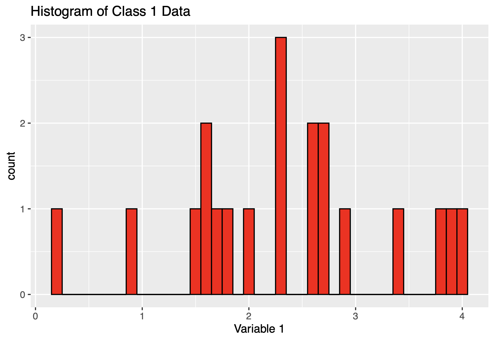
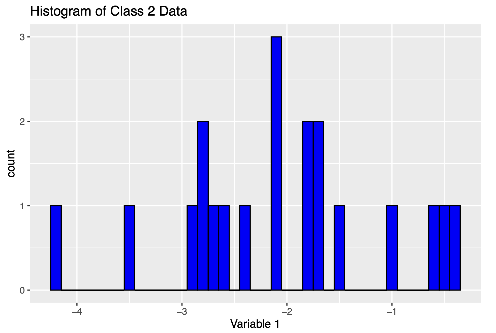
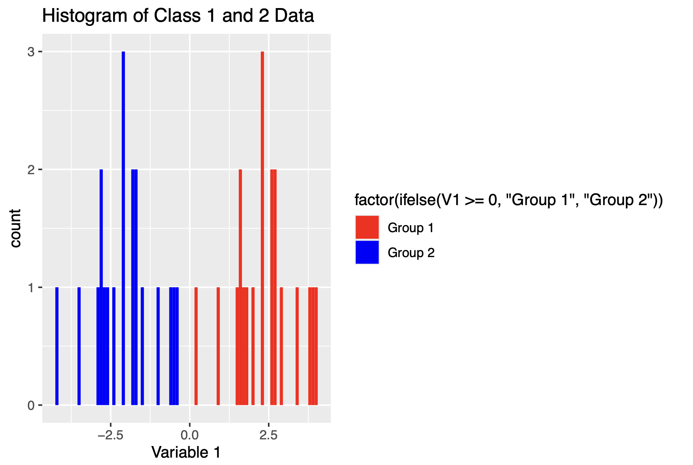

# Classify High-Dimensional Data

# General Project Overview

In machine learning, classification is a task that assigns a class label to examples from the problem domain. However, high dimensionality poses significant statistical challenges and renders many traditional classification algorithms impractical to use.

In this project, we will first learn some classical supervised classification techniques (decision trees, random forests, support vector machines, etc.) and discuss the curse of dimensionality.

Next, we will mainly explore Penalized Discriminant Analysis (PDA), which is designed to classify high-dimensional data as an extension of the classical Linear Discriminant Analysis. It classifies data by finding the optimal lower-dimension projections that reveal “interesting structures” in the original dataset.

Finally, we will implement PDA to analyze a real-life colon cancer dataset alongside some simple toy examples. Comparisons are also drawn to the performance of each model.

A link to the full page with all of the SPA DRP projects of Autumn 2023 (including mine) is provided [here](https://spa-drp.github.io///past-projects/2023-autumn/).

My results were summarized in an end of quarter presentation. The full slide deck can be found [here](https://docs.google.com/presentation/d/1oSrP5NRSWhoQRwXVjOmNRvVN8d4FA-LlYU0DCK1PzhE/edit?usp=sharing).

In order to access the projection pursuit packages

# Files

- `./data` contains the colon cancer dataset.
- `./code` includes all of the code.
  - `./code/annotation`: annotations of useful R functions.
 
# Set Up Side Note

In order to access the projection pursuit library and its functions, you'll first need to load `devtools` and install like so:

```{r}
library(devtools)
install_github("EK-LEE/classPP")
```

# Dummy Example Results

Below are the 1-D and 2-D projection experiments on a dummy simulation.

I've also provided some example code if reproduction is of interest.

  - There are 2 class labels, class1 or class2, that the data is marked as and 20 samples per class.

  - There are 40 columns (1 of which is a class label, distinguishing between class1 or class2).

  - All 40 samples have 38 columns with completely arbitrary data generated by `rnorm()`.

  - The 1st column is a special column - its data is `rnorm()` plus or minus 2.2 depending on which class it is.

```{r}
num_dimensions <- 39
num_data_points <- 20

mean_class <- 2.2

set.seed(123)
class1_data <- matrix(rnorm(num_data_points * num_dimensions), nrow = num_data_points)
class1_data[, 1] <- class1_data[, 1] + mean_class
class1_data <- cbind(class1_data, rep(1, num_data_points))

set.seed(123)
class2_data <- matrix(rnorm(num_data_points * num_dimensions), nrow = num_data_points)
class2_data[, 1] <- class2_data[, 1] - mean_class
class2_data <- cbind(class2_data, rep(0, num_data_points))
```

<p float="left">
  
  
</p>

<p align="center">

</p>

The above histograms show how distinguishable the 2 classes are when graphed against the 1st column (Variable 1).

The 1st column is thus the best indicator for which class our data falls into (aside from the class label).

# Colon Cancer Dataset Results

---

# Contributions

- The annotation file is merely my annotations over a pre-existing package by Eun-Kyung Lee. The link to her code is provided [here](https://github.com/EK-Lee/classPP/blob/master/R/PPindex.R).

- Zhaoxing Wu, my mentor, provided a list of machine learning literature for my understanding along with a lot of guidance for the direction of my project.

  - A link to her paper, which much of my project is based off of, can be found [here](https://jds-online.org/journal/JDS/article/1326/info).
 
- The dataset was fetched from Notterman, et al, Cancer Research vol. 61: 2001.

  - The link to the raw files can be accessed via [Princeton](http://genomics-pubs.princeton.edu/oncology/database.html).

# Learning Outcomes

- Learnt theoretics behind classical supervised classification techniques.

- Learnt the curse of dimensionality and how high dimension low sample size data ruins traditional machine learning models.

- Learnt the concept of Penalized Discriminant Analysis as an extension of Linear Discriminant Analysis.

- Created and ran multiple projection functions on real training / testing data and created corresponding graphs in R.

- Learnt how to create ideal dummy simulations and how to generalize results off it.
