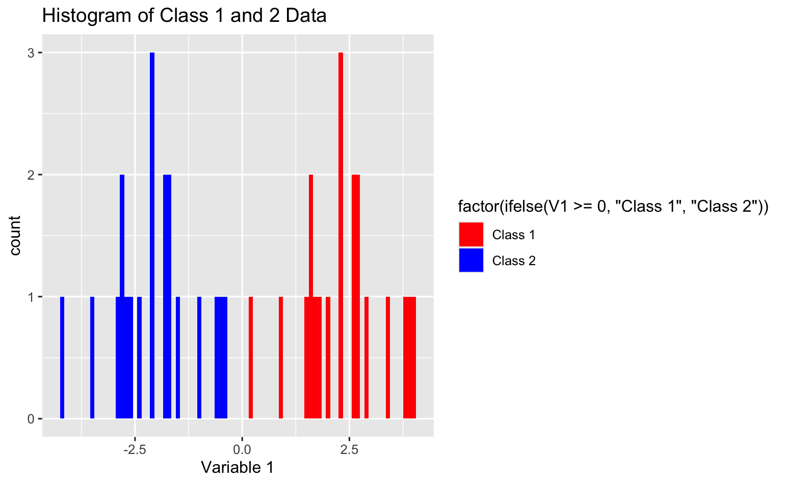

# Classify High-Dimensional Data

In machine learning, classification is a task that assigns a class label to examples from the problem domain. However, high dimensionality poses significant statistical challenges and renders many traditional classification algorithms impractical to use.

In this project, we will first learn some classical supervised classification techniques (decision trees, random forests, support vector machines, etc.) and discuss the curse of dimensionality.

Next, we will mainly explore Penalized Discriminant Analysis (PDA), which is designed to classify high-dimensional data as an extension of the classical Linear Discriminant Analysis. It classifies data by finding the optimal lower-dimension projections that reveal “interesting structures” in the original dataset.

Finally, we will implement PDA to analyze a real-life colon cancer dataset alongside some simple toy examples. Comparisons are also drawn to the performance of each model.

A link to the full page with all of the SPA DRP projects of Autumn 2023 (including mine) is provided [here](https://spa-drp.github.io///past-projects/2023-autumn/).

My results were summarized in an end of quarter presentation. The full slide deck can be found [here](https://docs.google.com/presentation/d/1oSrP5NRSWhoQRwXVjOmNRvVN8d4FA-LlYU0DCK1PzhE/edit?usp=sharing).

# Files

- `./data` contains the colon cancer dataset.
- `./code` includes all of the code.
  - `./code/annotation`: annotations of useful R functions.
 
# Set Up Side Note

In order to access the projection pursuit library functions, you'll first need to load `devtools` and install like so:

```{r}
library(devtools)
install_github("EK-LEE/classPP")
```

# Dummy Example Results

Below are the 1-D and 2-D projection experiments on a dummy simulation.

I've also provided some example code if reproduction is of interest.

  - There are 2 class labels, class1 or class2, that the data is marked as and 20 samples per class.

  - There are 40 columns (1 of which is a class label, distinguishing between class1 or class2).

  - All 40 samples have 38 columns with completely arbitrary data generated by `rnorm()`.

  - The 1st column is a special column - its data is `rnorm()` plus or minus 2.2 depending on which class it is.

```{r}
num_dimensions <- 39
num_data_points <- 20
mean_class <- 2.2

set.seed(123)
class1_data <- matrix(rnorm(num_data_points * num_dimensions), nrow = num_data_points)
class1_data[, 1] <- class1_data[, 1] + mean_class
class1_data <- cbind(class1_data, rep(1, num_data_points))

set.seed(123)
class2_data <- matrix(rnorm(num_data_points * num_dimensions), nrow = num_data_points)
class2_data[, 1] <- class2_data[, 1] - mean_class
class2_data <- cbind(class2_data, rep(0, num_data_points))

data <- rbind(class1_data, class2_data)
data_df <- as.data.frame(data)

ggplot(data_df, aes(x = V1, fill = factor(ifelse(V1 >= 0, "Class 1", "Class 2")))) +
  geom_histogram(binwidth = 0.1) +
  scale_fill_manual(values = c("Class 1" = "red", "Class 2" = "blue")) +
  labs(title = "Histogram of Class 1 and 2 Data", x = "Variable 1")
```

<p align="center">

</p>

The above histogram shows how separable the 2 classes are when graphed against the 1st column (Variable 1).

The 1st column is thus the best indicator for which class our data falls into (aside from the class label).

Both LDA and PDA are able to recognize this, both producing highly separated 1-D and 2-D projections of the training data below:

```{r}
test_proportion <- 0.25
n <- nrow(data_df)
ind <- sample(1:n, test_proportion * n, replace = FALSE)

test <- (data_df[ind, 1:(n - 1)])
train <- (data_df[-ind, 1:(n - 1)])

target_labels <- data_df$V40
class_test <- as.data.frame(target_labels[ind])
class_train <- as.data.frame(target_labels[-ind])
par(mfrow = c(2, 2))

PP.opt = PP.optimize.anneal("LDA", 1, train, class_train)
PP.optimize.plot(PP.opt, train, class_train)
title("LDA")

PP.opt = PP.optimize.anneal("LDA", 2, train, class_train)
PP.optimize.plot(PP.opt, train, class_train)
title("LDA")

PP.opt = PP.optimize.anneal("PDA", 1, train, class_train, lambda = 0.1)
PP.optimize.plot(PP.opt, train, class_train)
title("PDA, Lambda = 0.1")

PP.opt = PP.optimize.anneal("PDA", 2, train, class_train, lambda = 0.1)
PP.optimize.plot(PP.opt, train, class_train)
title("PDA, Lambda = 0.1")

# etc.
```

<p float="left">
  
   
</p>

The barcharts below represent the importance of each column in the projections for LDA and PDA ($\lambda = 0.5$). 

Variable 1 is, unsurprisingly the most important variable in both LDA and PDA, with PDA projecting almost entirely upon the 1st column.

<p float="left">
  
   
</p>

# Colon Cancer Dataset Results

- In the colon cancer dataset, we predict whether a piece of connective tissue is normal or a malignant tumor.

  - 18 malignant cancer tumors are paired with 18 normal tissue.

  - There are also 3200 full length human cDNA and 3400 expressed sequence tags as columns.

- Altogether, we have a sample size of 36 and around 6600 features.

  - Class 1 represents normal tissue while Class 2 represents a malignant tumor.
 
- Let’s split training/testing in a 70:30 ratio, where we train on training data and project testing data

1. A 2-D LDA projection on the testing data is on the left and...

2. A 2-D PDA ($\lambda = 0.5$) projection on the testing data is on the right.

<p float="left">
  
   
</p>

1. The LDA projection on the testing data yields an accuracy of 0.8182.

2. The PDA projection on the testing data yields an accuracy of 0.9091.

To see if this is a good classification method or not, we can compare performance to a Support Vector Machine.

Using the `e1071` package in R, we can call the `svm()` function for a confusion matrix.

<p align="center">

</p>

$$\text{Accuracy (for SVM)} = \frac{TP + TN}{TP + TN + FP + FN} = \frac{6 + 2}{6 + 2 + 3 + 0} = 0.7273$$

The accuracy for PDA is substantially better.

# LDA vs. PDA ($\lambda = 0.5$)

A comparison of PDA's 10 most important columns and how important those corresponding columns are for LDA:

- *Note:*

  - *The height of the blue represents the significance of the column for PDA*

  - *The height of the red represents the significance of the column for LDA*

  - *In this case, blue > red makes sense since the columns are blue's most important (and not necessarily red's)*

<p align="center">

</p>

A comparison of LDA's 10 most important columns and how important those corresponding columns are for PDA:

- *Note:*

  - *The height of the blue represents the significance of the column for PDA*

  - *The height of the red represents the significance of the column for LDA*

  - *In this case, red > blue makes sense since the columns are red's most important (and not necessarily blue's)*

<p align="center">

</p>

# (Tentative!!!)

The following is a very incomplete comparison between t-test (measures significance of differences) and PDA.

However, I'll include it here in hopes I comeback to it at some time.

<p align="center">

</p>

---

# Contributions

- The annotation file is merely my annotations over a pre-existing package by Eun-Kyung Lee. The link to her code is provided [here](https://github.com/EK-Lee/classPP/blob/master/R/PPindex.R).

- Zhaoxing Wu, my mentor, provided a list of machine learning literature for my understanding along with a lot of guidance for the direction of my project.

  - A link to her paper, which much of my project is based off of, can be found [here](https://jds-online.org/journal/JDS/article/1326/info).
 
- The dataset was fetched from Notterman, et al, Cancer Research vol. 61: 2001.

  - The link to the raw files can be accessed via [Princeton](http://genomics-pubs.princeton.edu/oncology/database.html).

- Everything else (the dummy examples, the graphs, projections on the colon cancer data set, etc.) is entirely my work.

# Learning Outcomes

- Learnt theoretics behind classical supervised classification techniques.

- Learnt the curse of dimensionality and how high dimension low sample size data ruins traditional machine learning models.

- Learnt the concept of Penalized Discriminant Analysis as an extension of Linear Discriminant Analysis.

- Created and ran multiple projection functions on real training / testing data and created corresponding graphs in R.

- Learnt how to create ideal dummy simulations and how to generalize results off it.
