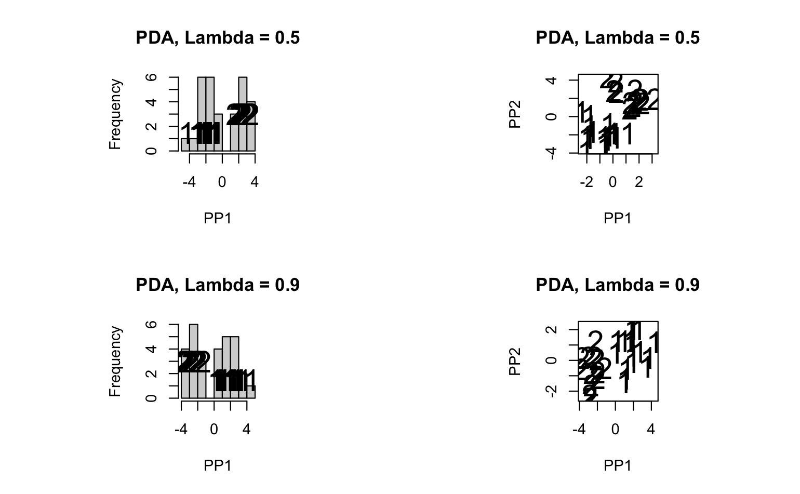

# Classify High-Dimensional Data

## September 2023 - December 2023

---

### Summary

In machine learning, classification is a task that assigns a class label to examples from the problem domain. However, high dimensionality poses significant statistical challenges and renders many traditional classification algorithms impractical to use.

In this project, I initially covered and implemented some classical supervised machine learning techniques (decision trees, random forests, support vector machines, etc.). I also discussed the curse of dimensionality with my project mentor, [Zhaoxing Wu](https://stat.uw.edu/about-us/people/zhaoxing-wu).

Next, I explored literature regarding Penalized Discriminant Analysis (PDA), which is designed to classify high-dimensional data as an extension of the classical Linear Discriminant Analysis (LDA). In other words, it classifies data by finding the optimal lower-dimension projections that reveal "interesting structures" in the original dataset.

Finally, I implemented PDA to analyze a real-life colon cancer dataset (with $36$ samples and $\approx 6600$ features) alongside some simple toy examples. At the very end, comparisons are drawn about the performance of different machine learning models on the small $n$ large $p$ problem. My results were summarized in an end of quarter presentation to biostatistics/statistics graduate students. It can be found in the **Links** section.

---

## Links

- The literature my mentor and I covered are listed in this [pdf document](https://github.com/LiuElvin/Liu_Portfolio/blob/main/projects/project2/pdf2/DRP_meeting.pdf)

- For those interested, all of the SPA DRP projects of Autumn 2023 (including mine) are showcased [here](https://spa-drp.github.io///past-projects/2023-autumn/)

- The full slide deck presentation can be accessed at the provided [link](https://docs.google.com/presentation/d/1oSrP5NRSWhoQRwXVjOmNRvVN8d4FA-LlYU0DCK1PzhE/edit?usp=sharing)

## Files

Files for my [Project 2 repository](https://github.com/LiuElvin/STAT_499_Research_Project/tree/main).

- [`./data`](./data) contains the colon cancer dataset.
- [`./code`](./code) includes all of the code.
  - [`./code/annotation`](./code/annotation.Rmd): annotations of useful R functions.
 
## Set Up Instructions

The projection functions for `R` were created by [Eun-Kyung Lee](https://pure.ewha.ac.kr/en/persons/eun-kyung-lee). 

In order to access them, you'll first need to load up the `devtools` package and install directly from her GitHub repository like so:

```{r}
library(devtools)
install_github("EK-LEE/classPP")
```

## Dummy Examples

Below I present one-dimensional and two-dimensional LDA and PDA projections on a dummy simulation.

I've also provided sample code for those interested in a reproduction of the results.

Some notes about the simulation below are that
    
- there are 40 samples total

  - each sample is marked as either class1 or class2 (20 samples per class)

- there are 40 columns total

    - the first column (Variable 1) is generated as `rnorm(0, 1)` plus or minus 2.2, depending on the class of the sample
   
    - 38 columns contain data that is randomly generated using `rnorm(0, 1)` such that they are pure noise
 
    - the last column is the class label to distinguish between class1 and class2

```{r}
num_dimensions <- 39
num_data_points <- 20
mean_class <- 2.2

set.seed(123)
class1_data <- matrix(rnorm(num_data_points * num_dimensions), nrow = num_data_points)
class1_data[, 1] <- class1_data[, 1] + mean_class
class1_data <- cbind(class1_data, rep(1, num_data_points))

set.seed(123)
class2_data <- matrix(rnorm(num_data_points * num_dimensions), nrow = num_data_points)
class2_data[, 1] <- class2_data[, 1] - mean_class
class2_data <- cbind(class2_data, rep(0, num_data_points))

data <- rbind(class1_data, class2_data)
data_df <- as.data.frame(data)

ggplot(data_df, aes(x = V1, fill = factor(ifelse(V1 >= 0, "Class 1", "Class 2")))) +
  geom_histogram(binwidth = 0.1) +
  scale_fill_manual(values = c("Class 1" = "red", "Class 2" = "blue")) +
  labs(title = "Histogram of Class 1 and 2 Data", x = "Variable 1")
```

<p align="center">

</p>

The histogram above graphs the counts of the first column from each class.

- Notice how separable the 2 classes are (blue and red are distinctly separated)

- On the other hand, a graph of the 38 randomly generated columns yields no pattern

Thus, the first column is the best indicator of which class a given sample falls into (outside of the class label).

**Subsequently, a good projection technique will recognize that the first column provides the most information about class.**

I use 3/4 of the dataset to create one and two dimensional LDA and PDA projections:

```{r}
test_proportion <- 0.25
n <- nrow(data_df)
ind <- sample(1:n, test_proportion * n, replace = FALSE)

test <- (data_df[ind, 1:(n - 1)])
train <- (data_df[-ind, 1:(n - 1)])

target_labels <- data_df$V40
class_test <- as.data.frame(target_labels[ind])
class_train <- as.data.frame(target_labels[-ind])
par(mfrow = c(2, 2))

PP.opt = PP.optimize.anneal("LDA", 1, train, class_train)
PP.optimize.plot(PP.opt, train, class_train)
title("LDA")

PP.opt = PP.optimize.anneal("LDA", 2, train, class_train)
PP.optimize.plot(PP.opt, train, class_train)
title("LDA")

PP.opt = PP.optimize.anneal("PDA", 1, train, class_train, lambda = 0.1)
PP.optimize.plot(PP.opt, train, class_train)
title("PDA, Lambda = 0.1")

PP.opt = PP.optimize.anneal("PDA", 2, train, class_train, lambda = 0.1)
PP.optimize.plot(PP.opt, train, class_train)
title("PDA, Lambda = 0.1")

# etc. for PDA lambda = 0.5 and 0.9
```

<p float="center">
  
   
</p>

Note how well separated classes 1 and 2 are when projected downwards from 39 dimensions - our models should have recognized the importance of the first column.

To verify, let's plot a barchart for each column and see how LDA and PDA rank each columns' importance. The frequency of the columns should total up to 1.

```{r}
# Check the importance of each variable in LDA
PP.opt = PP.optimize.anneal("LDA", 1, train, class_train)
LDA_coefficient <- cbind( abs(as.data.frame(PP.opt[["proj.best"]])), variable = 1:(n - 1))
ggplot(LDA_coefficient, aes(x = variable, y = V1)) +
  geom_bar(stat = "identity") +
  geom_vline(xintercept = 1) +
  labs(title = "LDA", x = "Variable", y = "Frequency") +
  scale_x_continuous(breaks = 1:(n - 1)) + scale_y_continuous(limits = c(0, 1))

# Check the importance of each variable in PDA for lambda = 0.5
PP.opt = PP.optimize.anneal("PDA", 1, train, class_train, lambda = 0.5)
LDA_coefficient <- cbind( abs(as.data.frame(PP.opt[["proj.best"]])), variable = 1:(n - 1))
ggplot(LDA_coefficient, aes(x = variable, y = V1)) +
  geom_bar(stat = "identity") +
  geom_vline(xintercept = 1) +
  labs(title = "PDA, Lambda = 0.5", x = "Variable", y = "Frequency") +
  scale_x_continuous(breaks = 1:(n - 1)) +
  scale_y_continuous(limits = c(0, 1))
```

<p float="center">
  
   
</p>

As expected, Variable 1 is the most important variable in both the LDA and PDA models, with the PDA model projecting almost entirely onto the first column.

## Application on a Colon Cancer Dataset

In the case of tumors, we'd like to identify which genetic factors contribute the most to a malignant tumor. This way, we can correctly diagnose patients based off of a select number of important variables. Unfortunately, datasets for tumor tissue contain thousands upon thousands of expressed sequence features and only a few samples. If we naively apply traditional machine learning techniques, we'll run into the curse of dimensionality. This is where LDA and PDA shine.

In the colon cancer dataset, we predict whether a piece of connective tissue is normal or malignant.

- Class 1 represents normal tissue while Class 2 represents a malignant tumor

- There are 18 malignant tumor samples and 18 normal tissue samples

- The columns compose of 3200 full-length human cDNA and 3400 expressed sequence tags

In other words, $p \approx 6600$ and $n = 36$ such that we have a large $p$ small $n$ problem.

To test the classification performances of LDA and PDA, let's split training and testing data in a 70:30 split, where the 2-D projection is produced from our training data and we project the testing data onto this 2-D plane.

- The two-dimensional LDA projection of the testing data is on the left

- The two-dimension PDA ($\lambda = 0.5$) projection of the testing data is on the right

<p float="center">
  
   
</p>

The results are as follows:

1. The two-dimensional LDA projection on the testing data yields an accuracy of 0.8182

2. The two-dimensional PDA projection on the testing data yields an accuracy of 0.9091

To check if these classification results are good or not, we can compare the performances with a more standard machine learning model like the support vector machine.

Utilizing the `R` package `e1071`, we can call the `svm()` function to apply a support vector machine and return a confusion matrix of the results.

<p align="center">

</p>

$$\text{Accuracy (for SVM)} = \frac{TP + TN}{TP + TN + FP + FN} = \frac{6 + 2}{6 + 2 + 3 + 0} = 0.7273$$

0.9091 > 0.7273 such that in this case, the accuracy of PDA is substantially higher than the accuracy of SVM.

PDA appears to be a fairly decent method for this example, although not perfect.

## LDA vs. PDA ($\lambda = 0.5$)

Belows graph compares the importance of PDA's ten most important columns and the importance of those same ten columns for LDA:

<p align="center">

</p>

*Note*

- *The height of the blue bar represents the significance of the column for PDA*

- *The height of the red bar represents the significance of the column for LDA*

*In this case, blue > red makes sense since the columns are PDA's most important (and not necessarily LDA's most important)*

Belows graph compares the importance of LDA's ten most important columns and the importance of those same ten columns for PDA:

<p align="center">

</p>

*Note*

- *The height of the blue bar represents the significance of the column for PDA*

- *The height of the red bar represents the significance of the column for LDA*

*In this case, red > blue makes sense since the columns are LDA's most important (and not necessarily PDA's most important)*

## *Incomplete*

The following is a **very** incomplete comparison between the t-test and PDA models.

Nearing the end of the project, I prioritized my presentation over this portion. However, I've left a graphical comparison for those interested.

<p align="center">

</p>

---

## Contributions

- The annotation file of my GitHub contains some clarifying comments I wrote over Professor Lee's package for `PPindex`

  - A link to her code is provided [here](https://github.com/EK-Lee/classPP/blob/master/R/PPindex.R)

- My mentor, Zhaoxing Wu, provided a lot of feedback and guidance for my project

  - A link to her paper, which much of my project is based off of, can be found [here](https://jds-online.org/journal/JDS/article/1326/info)

- I also read some scientific literature to better understand my research topic

  - The specific papers and textbooks can be found in my mentor's [syllabus](https://github.com/LiuElvin/Liu_Portfolio/blob/main/projects/project2/pdf2/DRP_meeting.pdf)
 
- The colon cancer dataset I used was fetched from Notterman, et al, Cancer Research vol. 61: 2001

  - The raw files can be accessed via [Princeton](http://genomics-pubs.princeton.edu/oncology/database.html)

- Everything else, from the dummy examples to the column comparison graphs to the projections, was entirely my work

## Learning Outcomes

- Implemented classical supervised classification techniques in `R`

- Learnt the curse of dimensionality and how high dimensional low sample size data ruins traditional machine learning algorithms
